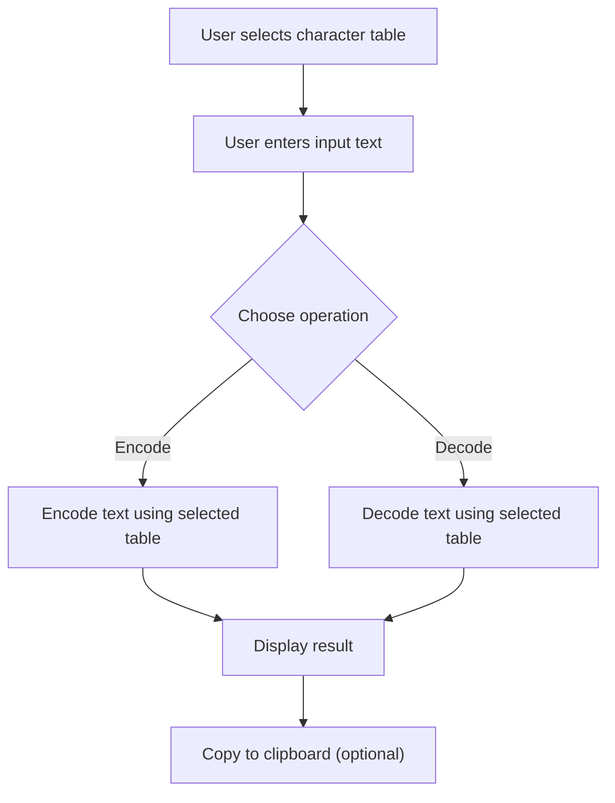

## 1. Product Overview
A modern Base64 encoder/decoder application with support for custom character tables. Designed for developers and technical users who need flexible encoding options, including specialized tables like TT playback encoding.

## 2. Core Features

### 2.1 User Roles
| Role | Registration Method | Core Permissions |
|------|---------------------|------------------|
| User | None (no auth) | Encode/decode text, manage character tables |

### 2.2 Feature Module
1. **Main Encoder/Decoder**: Text input/output, encode/decode actions, copy to clipboard
2. **Character Table Selector**: Preset tables (Default Base64, TT Playback, URL-safe, etc.) + custom table input
3. **Visual Feedback**: Real-time conversion, error handling, success animations

### 2.3 Page Details
| Page Name | Module Name | Feature description |
|-----------|-------------|---------------------|
| Home | Encoder/Decoder | Text input area, output display, encode/decode toggle, copy button |
| Home | Table Selector | Dropdown for preset tables, custom table input with validation |
| Home | Status Bar | Conversion status, character count, encoding type indicator |

## 3. Core Process

## 4. User Interface Design

### 4.1 Design Style
- **Primary color**: Deep indigo (#6366f1) with gradient accents
- **Secondary colors**: Purple (#8b5cf6), cyan (#06b6d4)
- **Background**: Dark mode with glassmorphism effects
- **Button style**: Rounded (12px), 3D hover effect with subtle shadow lift
- **Font**: JetBrains Mono (monospace) for code, Inter for UI text
- **Layout**: Card-based with floating elements and micro 3D transforms
- **Icons**: Lucide React - clean, modern line icons

### 4.2 Page Design Overview
| Page Name | Module Name | UI Elements |
|-----------|-------------|-------------|
| Home | Header | Gradient title with 3D text effect, subtitle |
| Home | Input Area | Textarea with glass border, placeholder, character counter |
| Home | Control Panel | Encode/Decode toggle buttons (3D effect), table selector dropdown |
| Home | Output Area | Read-only textarea with copy button, animated success indicator |
| Home | Table Editor | Custom table input with validation, reset button |

### 4.3 Responsiveness
- Desktop-first design (1200px+)
- Tablet adaptive (768px+)
- Mobile responsive (360px+) with stacked layout

### 4.4 Micro 3D Elements
- Cards with perspective transforms on hover
- Buttons with subtle Z-axis translation
- Gradient borders with depth
- Floating decorative elements with parallax effect

## 5. Character Tables

### 5.1 Preset Tables
1. **Default Base64**: ABCDEFGHIJKLMNOPQRSTUVWXYZabcdefghijklmnopqrstuvwxyz0123456789+/
2. **TT Playback**: -0123456789ABCDEFGHIJKLMNOPQRSTUVWXYZ_abcdefghijklmnopqrstuvwxyz
3. **URL-Safe**: ABCDEFGHIJKLMNOPQRSTUVWXYZabcdefghijklmnopqrstuvwxyz0123456789-_
4. **Hex64**: 0123456789ABCDEFabcdefghijklmnopqrstuvwxyz+/
5. **Base64url (RFC 4648)**: Same as URL-Safe

### 5.2 Custom Table
- User can input any 64-character string
- Validation: Must be exactly 64 unique characters
- Optional padding character customization