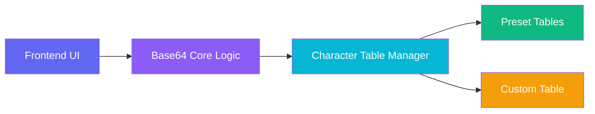

## 1. Architecture Design



## 2. Technology Description

* **Frontend**: React\@18 + TypeScript + TailwindCSS\@3 + Vite

* **Initialization Tool**: vite-init (react-ts template)

* **Backend**: None (pure frontend application)

* **Icons**: lucide-react

## 3. Route Definitions

| Route | Purpose                        |
| ----- | ------------------------------ |
| /     | Home page with encoder/decoder |

## 4. API Definitions

No backend APIs required. All logic runs client-side.

## 5. Component Structure

```
src/
├── components/
│   ├── Header.tsx           # Title with 3D effect
│   ├── InputArea.tsx        # Text input for encoding/decoding
│   ├── OutputArea.tsx       # Result display with copy button
│   ├── ControlPanel.tsx     # Encode/decode toggle, table selector
│   ├── TableSelector.tsx    # Preset table dropdown
│   ├── TableEditor.tsx      # Custom table input
│   └── StatusBar.tsx        # Character count, status
├── utils/
│   ├── base64.ts            # Base64 encoding/decoding core logic
│   └── tables.ts            # Preset character tables
├── hooks/
│   └── useBase64.ts         # Custom hook for Base64 operations
├── App.tsx                  # Main app container
└── main.tsx                 # Entry point
```

## 6. Core Logic

### 6.1 Base64 Encoding Algorithm

1. Convert input string to UTF-8 bytes
2. Group bytes into 3-byte chunks
3. Split each chunk into 4 x 6-bit values
4. Map each 6-bit value to character using selected table
5. Add padding (`=`) if chunk is less than 3 bytes

### 6.2 Base64 Decoding Algorithm

1. Remove padding characters
2. Map each character to 6-bit value using selected table
3. Group 4 x 6-bit values into 3-byte chunks
4. Convert bytes back to UTF-8 string

### 6.3 Character Table Validation

* Must contain exactly 64 characters

* All characters must be unique

* Padding character defaults to `=`

## 7. Data Model

### 7.1 Preset Tables

| Table Name  | Characters                                                        |
| ----------- | ----------------------------------------------------------------- |
| Default     | ABCDEFGHIJKLMNOPQRSTUVWXYZabcdefghijklmnopqrstuvwxyz0123456789+/  |
| TT Playback | -0123456789ABCDEFGHIJKLMNOPQRSTUVWXYZ\_abcdefghijklmnopqrstuvwxyz |
| URL-Safe    | ABCDEFGHIJKLMNOPQRSTUVWXYZabcdefghijklmnopqrstuvwxyz0123456789-\_ |
| Hex64       | 0123456789ABCDEFabcdefghijklmnopqrstuvwxyz+/                      |

### 7.2 State Management

* `inputText`: string - User input

* `outputText`: string - Result

* `operation`: 'encode' | 'decode' - Current operation mode

* `selectedTable`: string - Name of selected preset table

* `customTable`: string - User-defined table

* `isCustom`: boolean - Whether using custom table

* `error`: string | null - Error message

